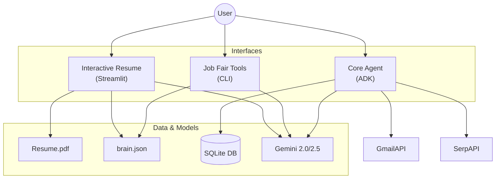

# 🤖 AI Career Suite

> **A comprehensive AI-powered toolkit for automating job search, interactive professional branding, and networking.**

[](https://www.python.org/downloads/)
[](https://github.com/google/adk)
[](https://streamlit.io/)
[](https://opensource.org/licenses/MIT)

---

## 🎯 Overview

This project has evolved from a single backend agent into a full **AI Career Suite**, leveraging Google's Gemini models (Flash 2.0 & 2.5) to power three distinct interfaces:

1. **🤖 Core Automation Agent**: A heavy-duty backend agent for automated job searching, email management, and application tracking.
2. **📄 Interactive Resume**: A Streamlit-based web app that lets recruiters "chat" with your resume and professional persona.
3. **🎪 Job Fair Companion**: A CLI tool for real-time networking support (elevator pitches, company briefs, QR codes).

---

## ✨ Modules

### 1. 📄 Interactive Resume (Streamlit App)

A modern, interactive way to present your professional profile. Users can chat with an AI representation of you that has access to your resume and "hidden context" (soft skills, personality, stories).

- **Chat with Resume**: RAG-based Q&A over your PDF resume.
- **"Brain" Integration**: Accesses a `brain.json` file to answer behavioral questions (STAR method) and share personality traits not found in a CV.
- **Artifact Rendering**: Dynamically displays project images and links when relevant topics are discussed.
- **Gemini 2.0 Flash**: Uses the latest fast model for instant responses.

**Run it:**

```bash
streamlit run streamlit_app.py
```

### 2. 🎪 Job Fair Companion (CLI Tool)

A lightweight tool designed for use during career fairs or networking events.

- **🎤 Elevator Pitch**: Generates a tailored 30-second pitch based on a specific company's job description.
- **🏢 Company Brief**: Generates a 1-page "cheat sheet" about a company (mission, recent news, values) in seconds.
- **📱 QR Code Generator**: Instantly creates a QR code pointing to your portfolio or LinkedIn.
- **💼 Portfolio Export**: Generates a static HTML portfolio with a Mermaid.js network graph of your connections.

**Run it:**

```bash
# Generate a pitch
python run_job_fair_tool.py --tool pitch --input "Company Name" --jd "Job Description text..."

# Get a company brief
python run_job_fair_tool.py --tool brief --input "Google"

# Generate Portfolio
python run_job_fair_tool.py --tool portfolio
```

### 3. 🤖 Core Automation Agent (Backend)

The original powerhouse agent built with Google's Agent Development Kit (ADK).

- **🔍 Automated Job Discovery**: Aggregates jobs via SerpAPI (LinkedIn, Indeed, etc.).
- **📧 Email Intelligence**: Manages Gmail (read, search, draft) and tracks cold outreach.
- **📊 Application Tracking**: Manages the full lifecycle of job applications.
- **📝 Content Generation**: Writes personalized cover letters.
- **🧠 Persistent Memory**: SQLite-backed session management.

**Run it:**

```bash
python agent.py
```

### 4. ⚡ Lite Agent (Console)

A stripped-down, fast console agent for quick queries against your resume without spinning up the full ADK stack.

**Run it:**

```bash
python fast_agent.py
```

---

## 🏗️ Architecture



---

## 🚀 Quick Start

### Prerequisites

- Python 3.11+
- Google Cloud Project (for Gmail API)
- SerpAPI account (for job search)

### Installation

1. **Clone & Install**

    ```bash
    git clone <repository-url>
    cd Agent_V2
    pip install -r requirements.txt
    ```

2. **Configure Environment**

    Create a `.env` file:

    ```env
    GOOGLE_API_KEY="your_gemini_api_key"
    SERPAPI_KEY="your_serpapi_key"
    ```

3. **Setup Data**
    - Place your resume in `public/Resume.pdf`.
    - (Optional) Configure `data/brain.json` with your "hidden context".

---

## 📁 Project Structure

```text
Agent_V2/
├── agent.py                  # Core ADK Agent
├── streamlit_app.py          # Interactive Resume App
├── run_job_fair_tool.py      # Job Fair CLI Tools
├── fast_agent.py             # Lite Console Agent
├── tools_2.py                # Shared Tool Implementations
├── data/
│   └── brain.json            # Personality & Behavioral Data
├── public/
│   ├── Resume.pdf            # Your Resume
│   └── profile.png           # Profile Photo
├── documents/                # Parsed Documents
├── cover_letters/            # Generated Cover Letters
└── .github/workflows/        # Automation Workflows
```

---

## 🤝 Contributing

This is a personal project demonstrating advanced AI agent capabilities. Feel free to fork and adapt for your own use case.

---

## 📞 Contact

**Noah Haag** - Marine Biologist & AI Engineer

- GitHub: [https://github.com/NoahHaag]
- LinkedIn: [https://www.linkedin.com/in/noah-haag-961691161/]
- Email: [noahhaag1998@gmail.com]

---

**Built with Google ADK & Streamlit | Powered by Gemini 2.5 Flash**
